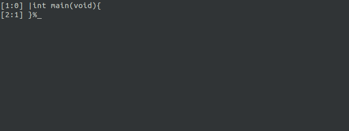

YET
----


YET is a standard-compliant implementation of [Becoms](https://github.com/OSCAPL/Becoms) written entirely in the [Chlore Programming Language](https://github.com/trap-representation/Chlore).

#### YET in action (GIF) ####


----

Every source file in this repository is licensed under the GPLv3 license, even if the text of the license is not explicitly placed at the start of the file. For files where the license is not explicitly placed in, modify/use/distribute them the way you would've had the following text been present in the file.

```
    Copyright (C) 2023  Somdipto Chakraborty

    This program is free software: you can redistribute it and/or modify
    it under the terms of the GNU General Public License as published by
    the Free Software Foundation, either version 3 of the License, or
    (at your option) any later version.

    This program is distributed in the hope that it will be useful,
    but WITHOUT ANY WARRANTY; without even the implied warranty of
    MERCHANTABILITY or FITNESS FOR A PARTICULAR PURPOSE.  See the
    GNU General Public License for more details.

    You should have received a copy of the GNU General Public License
    along with this program.  If not, see <https://www.gnu.org/licenses/>.
```

In case you're distributing the file, please put the aforementioned text at the beginning of the file you're about to distribute.
